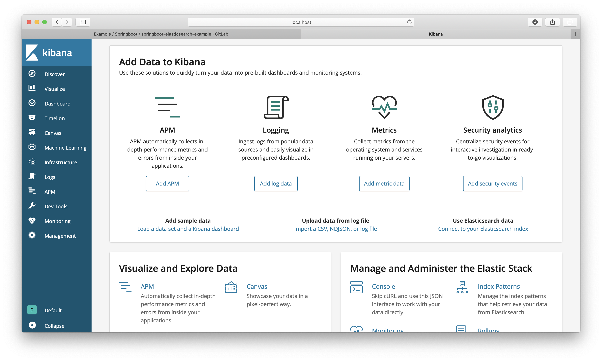

# Belajar elasticsearch angular6

Running elasticsearch and kibana via docker compose,

```docker
docker-compose up -d
```

Running angular via angular-cli

```npm
## install component
npm install

## serve angular
npm start
```


## Data migration

Open Kibana [http://localhost:5601](http://localhost:5601) -> Tab Dev Tools



```http request
# create index
PUT /products?pretty

# create data with bulk
POST /products/_doc/_bulk?pretty
{"index":{"_id":"1"}}
{"name":"Macbook Pro 13\"","qty":1,"tipe":"Laptop"}
{"index":{"_id":"2"}}
{"name":"Ipad 6 (9.7\"","qty":2,"tipe":"Tablet"}
{"index":{"_id":"3"}}
{"name":"Iphone XR","qty":3,"tipe":"Hanphone"}
```
